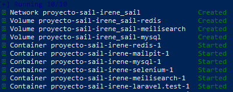
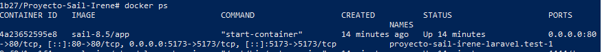
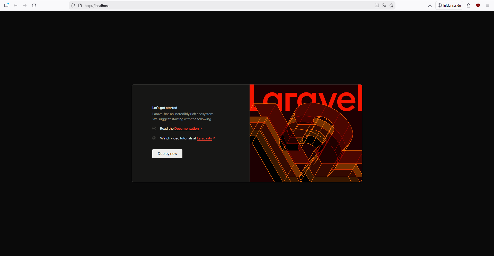
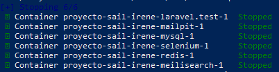

# Trabajo: Despliegue de Entorno Laravel con Sails

## 1. Requisitos Previos

Antes de comenzar, se han configurado los siguientes componentes en el sistema operativo:

* **Docker Desktop**: En ejecución y configurado para usar el motor de **WSL 2**.
* **WSL 2 (Windows Subsystem for Linux)**: Instalado y con una distribución de Linux (Ubuntu) operativa.
* **Terminal**: PowerShell o Windows Terminal.

---

## 2. Creación del Proyecto

Para evitar la instalación local de PHP o Composer, utilizamos un contenedor temporal de Docker para generar la estructura del proyecto.

Para acceder a la capa de Linux desde la terminal de Powershell, ejecutamos el comando `wsl` una vez que estamos en la carpeta donde queremos tener el proyecto.

Para crear la carpeta del proyecto, se utiliza el siguiente comando, en mi caso:
```
curl -s "https://laravel.build/Proyecto-Sail-Irene" | bash
```



---

## 3. Iniciar el entorno

Para la inicialización del entorno, primero debemos entrar en el carpeta creada `cd Proyecto-Sail-Irene/` y ejecutar `./vendor/bin/sail up -d`. Para que se ejecute en segundo plano, se agrega el `-d` final.

Tras esto, se comprueba que está funcionando todo en orden con `docker ps`.



---

## 4. Migraciones y prueba

Una vez sabemos que está todo en marcha, preparamos la base de datos:

```
./vendor/bin/sail artisan migrate 
```

Tras esto, esperamos un poco y al entrar a `http://localhost` sale lo siguiente:



---

## 5. Detengo el contenedor

Detengo el contenedor con el siguiente comando

```
/vendor/bin/sail stop
```



Podemos dar por finalizada esta práctica.
